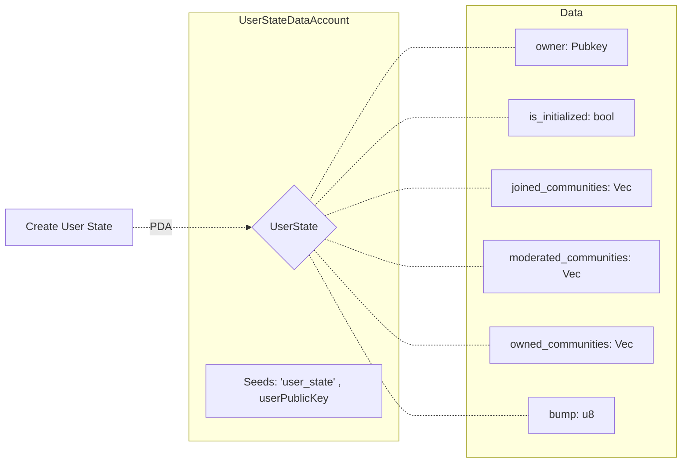

let tx = await program.methods.createUserState().accounts(
{
	owner: custom_member.publicKey,
	userState: custom_member_state,
	systemProgram: anchor.web3.SystemProgram.programId,
}
).signers([custom_member])
.rpc();
 
console.log(tx);
```
 

## Create Community
 
 
 
>EN
> - After creating your state account, you can create a community.
> - For this, you must generate the public key of your community with the PDA according to the specified seeds.
> - You can create a community account after giving the arguments and accounts with the `createCommunity()` method.
> 
> **The id and name you gave while generating the PDA must be the same as when creating it.**
```ts
 
const community_wallet_keypair = anchor.web3.Keypair.generate();
let community_wallet = new anchor.Wallet(community_wallet_keypair);
 
const community = anchor.web3.PublicKey.findProgramAddressSync(
	[
 anchor.utils.bytes.utf8.encode('community'),
 anchor.utils.bytes.utf8.encode('new_community'),
 new anchor.BN(2).toArrayLike(Buffer, "le", 8),
 provider.wallet.publicKey.toBuffer(),
	],
 program.programId
)[0];
 
const tx = await program.methods.
 
createCommunity(
	"new_community",
> TR
> - After creating your state account, you can create a community.
> - To do this, you must generate your community's PDA and public key according to the specified seeds and create a wallet for your community. This will be done automatically on the frontend side.
> - You can create a community account after providing the arguments and accounts with the `createCommunity()` method.
>
> **The id and name you give when creating a PDA must be the same when creating it.**
